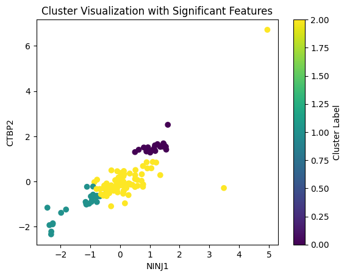

# omics

https://www.overleaf.com/read/wpkjfcgmvxkn#123416

# Dataset Description

## Proteomics Dataset

**proteomics.txt**: This dataset contains proteomic profiles of 140 patients with bladder cancer. The proteomic data is the result of high-throughput mass spectrometry, which quantitatively measures the abundance of proteins in biological samples.

**Rows**: Each row represents a different protein.

**Columns**: The first column is the Protein ID, and each of the following columns represents a patient (labeled BC.1, BC.2, ..., BC.140).

**Entries**: The numerical values are the expression levels or abundances of each protein in each patient's sample.

## Metadata Dataset

**metadata.csv**: This file contains additional information about the 140 patients whose proteomic data you have. Common types of metadata include demographic information (age, gender, ethnicity), clinical data (tumor size, histological grade, lymph node involvement, metastasis, treatment and response, survival status), and lifestyle factors (smoking history, family history of cancer). This data can provide context to the proteomic data and may reveal important correlations.

# Subpopulation Identification

## Pipeline for clustering patients

### Preprocessing

- Transpose: make each column represent a protein, and each row a patient.
- Handling Missing Values: Not necessary, since there's no missing values.
- Normalization: Given the scale of proteomics data, normalization is crucial. StandardScaler may be a good choice.
- Feature Selection or Dimensionality Reduction: PCA is a common choice for dimensionality reduction, but with thousands of features, we need more sophisticated methods:
  - Sparse PCA: Efficient with high-dimensional data, retaining interpretability.
  - t-Distributed Stochastic Neighbor Embedding (t-SNE): Effective for high-dimensional datasets, particularly in visualizing clusters in lower-dimensional space.
  - Uniform Manifold Approximation and Projection (UMAP): Similar to t-SNE but often better at preserving global structure.

### Clustering

- K-Means: A good starting point, but may not be optimal for high-dimensional data due to the curse of dimensionality.
- Hierarchical Clustering: Useful for revealing hierarchical structures in data.
- DBSCAN (Density-Based Spatial Clustering of Applications with Noise): Good for datasets with complex structures and noise.
- Gaussian Mixture Models (GMMs): More flexible than K-Means, as it assumes data is generated from a mixture of Gaussian distributions.

### Determining the Number of Clusters

- Elbow Method: For K-Means, but may not be clear with high-dimensional data.
- Silhouette Score: As you mentioned, useful for assessing the quality of clusters.
- Calinski-Harabasz Index: Another metric to evaluate the cluster validity.
- Cluster Stability Assessment: Evaluating the consistency of clusters across different subsamples of our data can be informative.

### Iterative Approach

Iterate over above steps, different combinations of dimensionality reduction and clustering algorithms can yield varying results.

### Visualization and Interpretation

Utilize visualization tools (like scatter plots from PCA, t-SNE, or UMAP reductions) to interpret and validate the clusters.

## Identifying the correct number of patient subpopulations
Considering the above GMM clustering, although the n_components is set to 4, but cluster2(indicated by green dot) is more likely an outlier, so we think the correct number of patient subpopulations is 3.

# Feature Selection

## Pipeline for feature selection

### Remove Outliers
Remove the data points that belong to the outlier cluster (cluster 2 in our case) to avoid skewing the feature selection.

### Feature Importance Methods

- ANOVA F-test: A statistical test used to compare the means of the features across the clusters.
- Mutual Information: A non-parametric method that measures the dependency between the features and the cluster assignment.
- Random Forests / Gradient Boosting Machines: Tree-based methods can provide feature importances based on how well they improve the purity of the node.
  
### Determining the Correct Number of Features

Keep:

- A certain number of features with the highest scores.
- Features that have a p-value below a certain threshold (for ANOVA).
- Features that have mutual information above a certain threshold.

### Validation

 Validate that the features we've selected are indeed indicative of the clusters.
 - Use the selected features to run a clustering algorithm again and check if the clusters are more distinct.
 - Apply a classification algorithm to predict cluster membership and assess its performance.

## Identifying the correct number of features

the new cluster assignment based on the selected 18 features has a similarity of 74% to the original assignmet, (although i also tried with 12 selected features with 78% similarity, by looking at the cluster visualization we think the one with 18 features is more accurate.)

Therefore, the correct number of features is 18. Selected features include  `['NINJ1', 'CTBP2', 'DOCK1', 'FAHD2A', 'IGLV5-45', 'STAT5A', 'MCM3', 'SELENOF', 'MANF', 'FKBP5', 'SEC24A', 'CEACAM7', 'ITGAM', 'ANKRD13A', 'S100A12', 'HBG2', 'PODN', 'FCN3']`

Adjusted Rand Index comparing the non-outlier groups: 0.7444328423606514

#Cluster analysis with the metadata
##Explores the relationship between patient metadata features and predefined patient clusters.The clusters were identified in previous analyses based on proteomic data.
##Methdology: 
###Data Integration: Combined the patient metadata with the existing cluster assignments to create a unified dataset for analysis.
###Statistical Examination: Conducted statistical tests to compare the distribution of metadata features across the different clusters. This included ANOVA for continuous variables and Chi-square tests for categorical variables.
###Cluster Characterization: Descriptive statistics were used to profile each cluster, focusing on the central tendencies and variabilities of metadata features within each group.

#Feature analysis with the metadata
##Investigated the relationship between selected proteomic features and patient metadata
###Statistical Analysis: conducted correlation analysis for continuous features and for encoded categorical variables to identify any significant associations with patient metadata.
###Machine Learning: A Random Forest algorithm was applied to assess feature importance in predicting clinical outcomes such as tumor size and survival status.
###Visualization: Heatmaps and bar charts were generated to visualize the strength and nature of the relationships between features and metadata.

